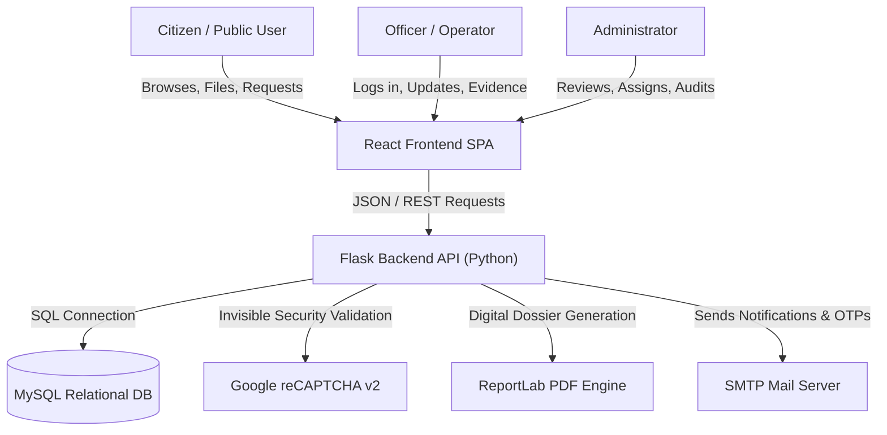
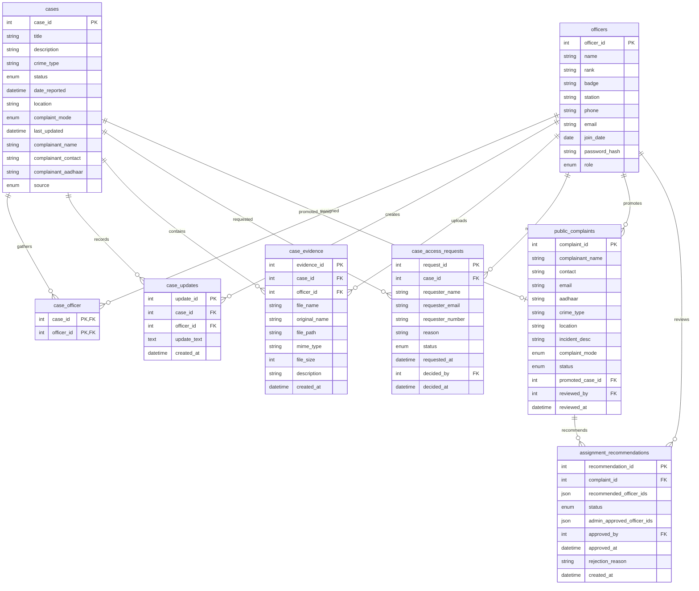
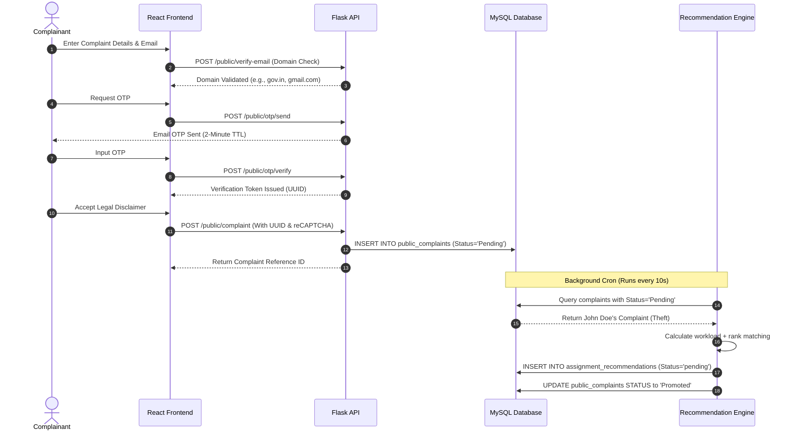
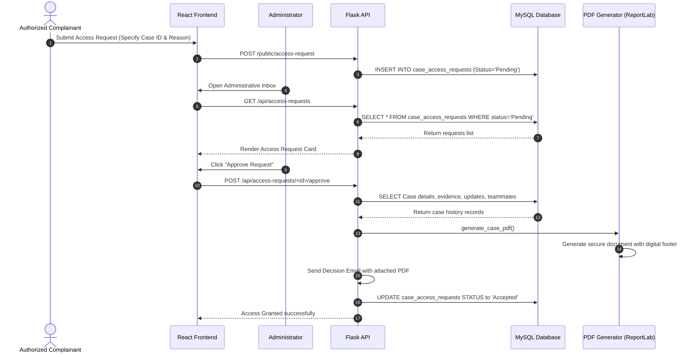

# Project Report: Themis's Domain
## Advanced Crime Record & Management System (CRMS)
### Bengaluru Police Department Command & Analytics Platform

---

> [!NOTE]
> This document serves as a comprehensive, production-grade technical report outlining the architecture, system design, feature set, security controls, database schemes, and data flows of **Themis's Domain** (formerly *Themis Nomos* / *HeraRecord*). This report is structured for academic project submissions and production engineering reviews.

---

## 1. Executive Summary
**Themis's Domain** is a highly polished, responsive, and secure digital command platform designed for the **Bengaluru Police Department**. The system replaces manual, error-prone crime tracking operations with an automated, role-based case management and citizen reporting platform. 

It provides an end-to-end framework starting from public complaint intake, transitioning into automated workload-balanced officer case assignments, proceeding to evidentiary record gathering, and concluding with legally compliant case dossier generation and digital signature verification.

---

## 2. System Architecture
The application is built using a modern **decoupled client-server architecture**:

### Technology Stack
- **Frontend Layer**: Single Page Application (SPA) utilizing React (embedded dynamically inside standard HTML5), styled using custom Vanilla CSS alongside a glassmorphism utility design system, and powered by Framer Motion for premium micro-animations.
- **Backend API Layer**: Python-based Flask server executing a RESTful API pattern, incorporating thread-safe local stores, secure file system ingestion, and connection pooling.
- **Database Layer**: MySQL database utilizing relational indexing, cascading foreign keys, transaction constraints, and multi-value unique constraints.
- **Security Integrations**: Invisible Google reCAPTCHA v2, SHA-256 validation, salt-hashed bcrypt password security, and multi-layer cryptographic validation tokens.
- **Utility Engines**: ReportLab PDF Generator (for dossier document publishing) and secure SMTP mailers (for citizen OTPs, administrative alerts, and officer assignment dispatches).

---

## 3. Database Schema Design
The database structure is designed to enforce strict referential integrity. It is structured into **8 core tables**:

### Table Definitions

#### 1. `officers`
Stores police department personnel, access credentials, and administrative roles.
- `officer_id` (INT, Primary Key, Auto Increment)
- `name` (VARCHAR, Not Null)
- `rank` (VARCHAR, Not Null) - e.g., Inspector, Sub-Inspector, Head Constable.
- `badge` (VARCHAR, Unique) - e.g., BPD-7821.
- `station` (VARCHAR)
- `phone` (VARCHAR)
- `email` (VARCHAR, Unique)
- `join_date` (DATE)
- `password_hash` (VARCHAR) - Bcrypt secure hash.
- `role` (ENUM: `'admin'`, `'inspector'`, `'viewer'`)

#### 2. `cases`
The main table storing active and historical crime investigations.
- `case_id` (INT, Primary Key, Auto Increment)
- `title` (VARCHAR, Not Null)
- `description` (TEXT)
- `crime_type` (VARCHAR) - e.g., Cyber Fraud, Theft, Assault, Ponzi Scheme.
- `status` (ENUM: `'Pending Review'`, `'Recommended'`, `'Assigned'`, `'Active'`, `'Solved'`, `'Closed'`, `'Rejected'`)
- `date_reported` (DATETIME, Default Current Timestamp)
- `location` (VARCHAR)
- `complaint_mode` (ENUM: `'Online'`, `'Offline'`)
- `source` (ENUM: `'public'`, `'officer'`)
- `complainant_name` (VARCHAR)
- `complainant_contact` (VARCHAR)
- `complainant_aadhaar` (CHAR(12))

#### 3. `case_officer`
A junction table enabling a many-to-many relationship mapping officers to their assigned cases.
- `case_id` (INT, Foreign Key referencing `cases.case_id` ON DELETE CASCADE)
- `officer_id` (INT, Foreign Key referencing `officers.officer_id` ON DELETE CASCADE)
- Primary Key is composite: `(case_id, officer_id)`

#### 4. `public_complaints`
Staging area for citizen-submitted complaints pending triage.
- `complaint_id` (INT, Primary Key, Auto Increment)
- `complainant_name` (VARCHAR, Not Null)
- `contact` (VARCHAR, Not Null)
- `email` (VARCHAR)
- `aadhaar` (CHAR(12), Not Null)
- `crime_type` (VARCHAR, Not Null)
- `location` (VARCHAR, Not Null)
- `incident_desc` (TEXT, Not Null)
- `status` (ENUM: `'Pending'`, `'Reviewed'`, `'Promoted'`, `'Rejected'`)
- `promoted_case_id` (INT, Nullable, Foreign Key referencing `cases.case_id`)
- `reviewed_by` (INT, Nullable, Foreign Key referencing `officers.officer_id`)
- `reviewed_at` (DATETIME)

#### 5. `case_access_requests`
Manages citizen applications to read secure case dossiers.
- `request_id` (INT, Primary Key, Auto Increment)
- `case_id` (INT, Foreign Key referencing `cases.case_id`)
- `requester_name` (VARCHAR)
- `requester_email` (VARCHAR)
- `requester_number` (VARCHAR)
- `reason` (TEXT)
- `status` (ENUM: `'Pending'`, `'Accepted'`, `'Rejected'`)
- `decided_by` (INT, Foreign Key referencing `officers.officer_id`)
- `decided_at` (DATETIME)

#### 6. `assignment_recommendations`
Stores automated recommendation engine records generated by the workload allocation algorithm.
- `recommendation_id` (INT, Primary Key, Auto Increment)
- `complaint_id` (INT, Foreign Key referencing `public_complaints.complaint_id`)
- `recommended_officer_ids` (JSON) - Array of selected officer IDs.
- `status` (ENUM: `'pending'`, `'approved'`, `'rejected'`)
- `admin_approved_officer_ids` (JSON, Nullable)
- `approved_by` (INT, Foreign Key referencing `officers.officer_id`)
- `approved_at` (DATETIME)

#### 7. `case_updates`
Maintains historical case timeline entries posted by assigned officers.
- `update_id` (INT, Primary Key, Auto Increment)
- `case_id` (INT, Foreign Key referencing `cases.case_id`)
- `officer_id` (INT, Foreign Key referencing `officers.officer_id`)
- `update_text` (TEXT)
- `created_at` (DATETIME)

#### 8. `case_evidence`
Tracks evidentiary files, secure physical paths, and audit details.
- `evidence_id` (INT, Primary Key, Auto Increment)
- `case_id` (INT, Foreign Key referencing `cases.case_id`)
- `officer_id` (INT, Foreign Key referencing `officers.officer_id`)
- `file_name` (VARCHAR) - Generated secure file name on storage.
- `original_name` (VARCHAR) - Sanitized user file name.
- `file_path` (VARCHAR(512))
- `mime_type` (VARCHAR(100))
- `file_size` (INT)
- `description` (VARCHAR)

---

## 4. Key Functional Features
Themis's Domain provides customized interfaces across three user classes:

### A. Citizen & Public Portal
- **Public Case Browser**: Interactive table to search active or solved public cases in real-time.
- **Secure Complaint Registration**: Digital intake for criminal incidents requiring full validation.
- **Dossier Access Request System**: Enables involved citizens (e.g., victims, defense counsel) to request certified copies of case updates and evidence records.
- **Multiphase Security Triage**: Uses a multi-step check-in (Email Verification $\rightarrow$ SMS/OTP Simulation $\rightarrow$ Disclaimer Acceptance) before filing.

### B. Staff & Officer Dashboard
- **Case Dossier Manager**: Full access to assigned cases, including historical logs, active team members, and telemetry.
- **Evidence Vault**: Secure upload panel supporting document, image, video, and audio evidence uploads with custom description logs.
- **Timeline Logs**: Allows case investigators to post micro-updates to the case dossier timeline to track active progress.
- **Secure Session Control**: Maintains dynamic routing keeping state across page reloads unless explicitly signing out.

### C. Administrator Command Center
- **Triage Queue**: Review citizen-submitted complaints. Direct ability to promote a complaint into an active case, assign officers, or reject false reports.
- **Workload Allocation Console**: Shows active officer workloads, statistics, and assignment maps.
- **Algorithm Review Board**: Interface reviewing system recommendations generated for pending cases, offering the option to approve recommended teams or adjust them manually.

---

## 5. Critical Workflows & Data Flows

### Workflow A: Citizen Complaint Registration & Promotion
This flowchart illustrates the step-by-step process of a citizen filing an online complaint, passing security checks, going through database staging, and getting triaged by the automated assignment engine.

---

### Workflow B: Secure Case Dossier Delivery
This flow outlines how a requester applies for secure document access, which is subsequently reviewed by an administrator and exported as a digitally generated PDF document.

---

## 6. Mathematical Model of the Case Assignment Algorithm
The automated allocation engine determines which officers are selected for a case based on **Crime Severity Matching** and a **Minimization Workload Function**.

### 1. Severity Matching Function
The algorithm maps the reported `crime_type` to a severity level $S$:
$$S(\text{crime\_type}) \in \{\text{Critical}, \text{High}, \text{Medium}\}$$

Based on $S$, the requirement vector $R_S$ dictates the exact counts of personnel needed per rank:
- **$\text{Critical}$**: 1 Inspector, 1 Sub-Inspector, 1 Head Constable.
- **$\text{High}$**: 1 Sub-Inspector, 1 Head Constable.
- **$\text{Medium}$**: 1 Sub-Inspector, 1 Head Constable.

### 2. Workload and Seniority Minimization Function
For a required rank $r$, the algorithm selects available officers by sorting them using a compound lexicographical key. Let the set of officers of rank $r$ be $O_r$. For each officer $o \in O_r$, we define:
1. **Workload Coefficient ($W_o$)**: The count of active cases currently assigned to officer $o$.
$$W_o = \sum_{c \in \text{Cases}} [\text{status}(c) = \text{'Active'} \land o \text{ is assigned to } c]$$
2. **Seniority Tiebreaker ($J_o$)**: The join date of officer $o$, represented as a UNIX timestamp.

The algorithm sorts $O_r$ in ascending order of the sorting tuple:
$$\text{SortKey}(o) = \langle W_o, J_o \rangle$$

The system assigns the top $k$ officers where $k$ is the requirement count for rank $r$, effectively minimizing the departmental workload variance:
$$\text{Minimize} \quad \sigma^2(W)$$

---

## 7. Comprehensive Security Controls

The platform implements multi-layer defense-in-depth:

| Security Domain | Implemented Mechanism | Objective / Threat Mitigated |
| :--- | :--- | :--- |
| **Authentication** | Password protection using **bcrypt (salt factor = 12)**. | Prevents credential theft, rainbow table attacks, and unauthorized access. |
| **Access Control** | Role-Based Access Control (RBAC) separating roles into `admin`, `inspector`, and `viewer`. | Enforces Least Privilege access to evidence vaults and administrative tools. |
| **Public Security** | **Invisible Google reCAPTCHA v2** integration on public endpoints. | Prevents denial-of-service (DoS) attacks and bot spamming of complaint channels. |
| **Email Verification** | Secure check-in via `/public/verify-email` filtering out dummy and unverified domains. | Prevents fake email spamming and ensures citizen communication delivery. |
| **OTP Validation** | Thread-safe `OTPStore` with **2-minute expiration** and a **3-attempt lock-out**. | Prevents brute-forcing of one-time codes and controls request rates. |
| **File System Security** | Filename sanitization, size checks, and UUID file storage. | Prevents directory traversal, file overrides, and malicious script execution. |
| **PDF Legality** | Cryptographic audit signature stamps printed on generated PDFs. | Ensures document integrity and provides tracking validation for police dossiers. |

---

## 8. Development Credentials & Testing
For testing, local databases are seeded with standard testing accounts:
- **Administrative Account**: Badge ID: `ADM-0001` · Password: `crms1234`
- **Staff Officer (Inspector)**: Badge ID: `BPD-7821` · Password: `crms1234`
- **Staff Officer (Sub-Inspector)**: Badge ID: `BPD-6543` · Password: `crms1234`
